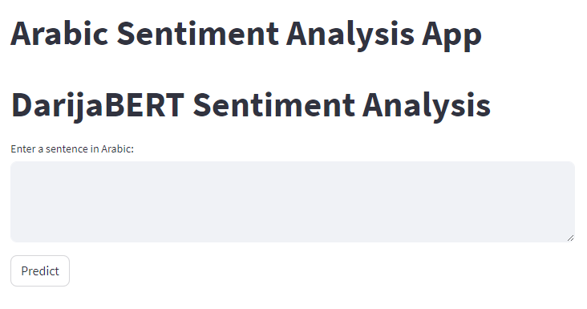
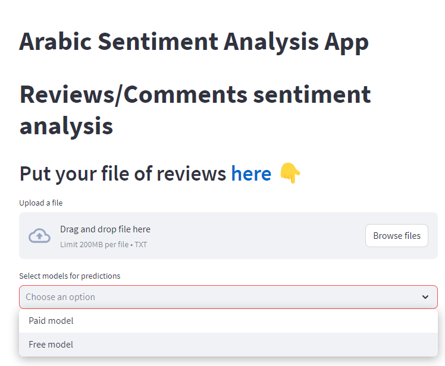
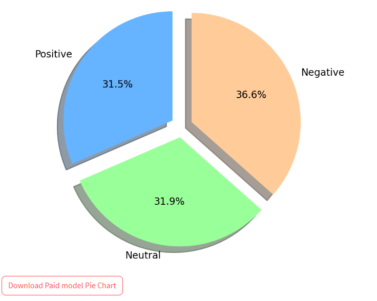

# Lgherbal - Arabic Sentiment Analysis App
  

## Overview

Lgherbal is an Arabic Sentiment Analysis App designed to analyze sentiments in Arabic text. The application employs deep learning models to classify text into positive, neutral, or negative sentiments. It provides a user-friendly interface for users to input Arabic sentences or upload text files for sentiment analysis.

## Features

- **Text Input or File Upload:** Analyze sentiments by entering Arabic sentences or uploading text files(Great for busineses to better understand their custumers).
  
- **for sentences**
  

- **Model Selection:** Choose from different sentiment analysis models to suit your preferences, and download the predictions.
  
  

- **Multilingual Support:** Handle Arabic text with a focus on linguistic nuances and expressions.
- **Offensive Sentiment Detection:** Detect offensive language and sentiments in the provided text.

## Getting Started

### Run the App

Run the Streamlit app: `streamlit run Interface/app.py`

## Models

Lgherbal currently supports three sentiment analysis models: Model 1(lstm paid) and Model 2(lstm free : less accurate), and (DarijaBERT). Users can select the desired model for predictions.

## File Structure

**In LGHERBAL/**

- `lgherbal/`: Main Directory 
- `Preprocessing&training`:Notebook used in trainig some models
- `credentials`: (Optional) Configuration file for streamlit, because it didn't work sometimes with default settings 
**In Interface/ :**

- `Interface/`: Directory containing the pre-trained sentiment analysis models and the files necessary to run the app.
- `app.py`: The main Streamlit application script.
- `lstm, lstm2, pac`: models used for predictions
- `Review.txt`: New data that you can upload in the app and see the results (note that this data was not used in training, you can eventually change the file)
- `stop_words.txt`: List of stop words used in text preprocessing.
- `clean_data.csv`: Cleaned dataset used for training and testing the models.

**In Machine learning Models for Hate Speech Detection**

- `Machine learning Models for Hate Speech Detection/`: Directory containing the ML models
- `best_svm_model, logistic_regression_model, and pac` : ML trained models used for predictions
- `data_cleaned.csv`: Cleaned dataset used for training and testing the models.

**In Tokenization , Pos tagging and Dependency Parsing**
- Applying Tokenization , Pos tagging and Dependency Parsing to our data

**- Note: We have Scrapped and Labeled Around 300 data lines manually collected through web scraping, but alone it didn't perform well**
